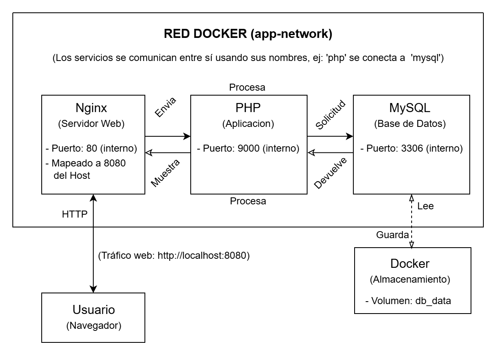
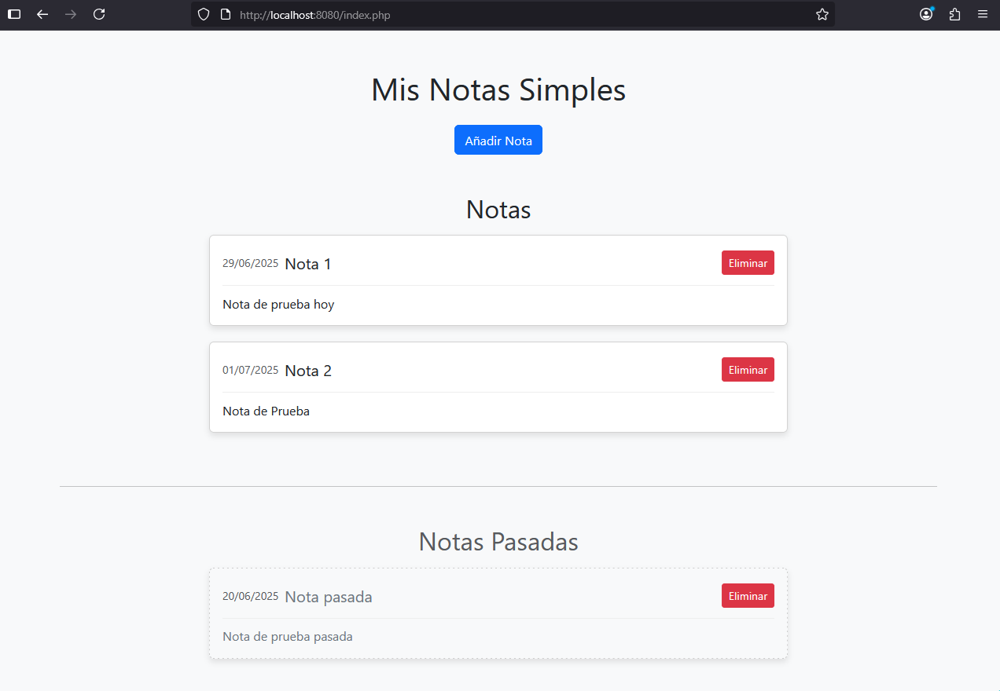
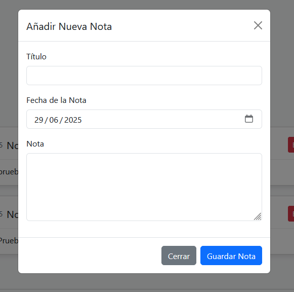

# Mi Gestor de Notas Simple

## Descripción
Este es un gestor de notas web minimalista que permite a los usuarios **añadir** y **eliminar** notas. Las notas se muestran en una única página, organizadas en dos secciones:
* **Notas:** Notas cuya fecha es hoy o posterior, ordenadas de la más cercana a la más lejana.
* **Notas Pasadas:** Notas cuya fecha es anterior a hoy, agrupadas por separado y ordenadas de la más reciente a la más antigua dentro de esta sección.

La aplicación utiliza **Nginx** como servidor web, **PHP** para la lógica de backend y **MySQL** para la persistencia de datos. Todo el entorno está orquestado con **Docker Compose**, y la interfaz de usuario está diseñada con **Bootstrap** para una apariencia limpia y responsiva.

---

## Arquitectura
El proyecto consta de tres servicios principales que se comunican entre sí en una red Docker personalizada:

* **Nginx (Servidor Web):** Actúa como la puerta de entrada a la aplicación. Recibe las solicitudes web del usuario y las reenvía a PHP para su procesamiento.
* **PHP (Aplicación):** Contenedor que ejecuta PHP-FPM, procesando la lógica de la aplicación como añadir, eliminar y consultar notas. Se conecta a la base de datos MySQL.
* **MySQL (Base de Datos):** Almacena de forma persistente todas las notas (título, contenido y fecha asociada). Utiliza un **volumen de Docker** para asegurar que los datos no se pierdan.

**Diagrama de Flujo Básico:**



---

## Requisitos
Para ejecutar esta aplicación, solo necesitas tener instalados en tu sistema:
* **Docker Desktop** (incluye Docker y Docker Compose)

---

## Instrucciones de Uso

1.  **Clona el repositorio:**
    Abre tu terminal o Git Bash y ejecuta:
    ```bash
    git clone https://github.com/ZekkiMe/mi-gestor-notas.git
    cd mi-gestor-notas
    ```
 

2.  **Inicia la aplicación con Docker Compose:**
    Desde el directorio raíz del proyecto (`mi-gestor-notas/`), ejecuta el siguiente comando:
    ```bash
    docker-compose up --build -d
    ```
    * `--build`: Solo es crucial la primera vez.

3.  **Accede a la aplicación:**
    Una vez que los contenedores estén operativos, abre tu navegador web y visita:
    ```
    http://localhost:8080
    ```
    *Para evitar conflictos la aplicación se expone en el puerto **8080**.*

4.  **Detén la aplicación:**
    Para detener y eliminar los contenedores (sin borrar los datos de MySQL, ya que persisten en un volumen):
    ```bash
    docker-compose down
    ```
    Si deseas detener los contenedores y **eliminar también los datos de la base de datos** (borrando todas tus notas), usa:
    ```bash
    docker-compose down -v
    ```

---

## Ejemplo de Uso

Aquí tienes una vista de la interfaz principal de la aplicación, mostrando las notas organizadas en sus respectivas secciones:




Al hacer clic en "Añadir Nota", se abrirá un modal para ingresar los detalles:




---

## Notas Adicionales
* La funcionalidad está limitada a añadir y eliminar notas, sin opciones de edición o de ordenación personalizadas más allá de la lógica implementada.
* El volumen `db_data` asegura que tus notas se mantengan guardadas incluso si reinicias o eliminas los contenedores.
